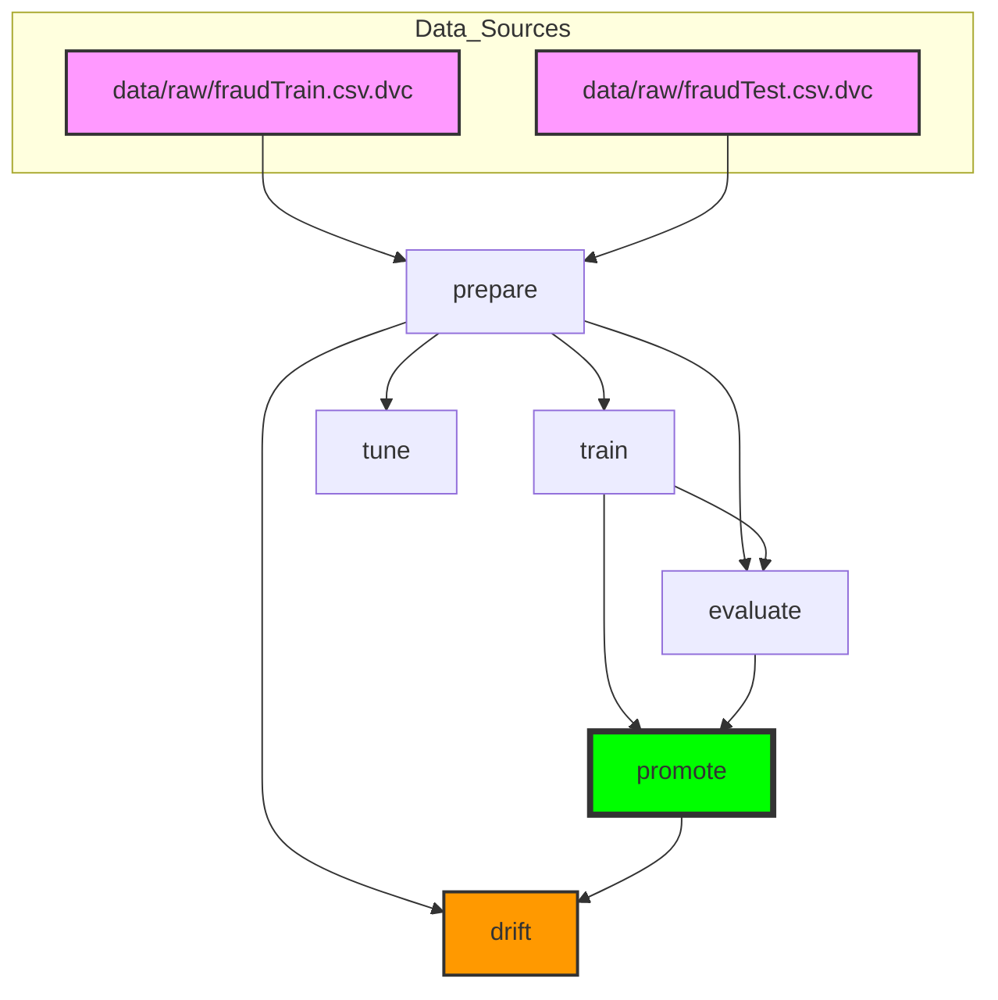

# 🚀 End-to-End MLOps Fraud Detection System
## Credit Card Fraud Detection with Feature Engineering, Model Training & Promotion

## 🤝 Team Contribution Table

| Member | Day | Role | Day Task |
|--------|-----|------|----------|
| Member 1 | Day 1 | Data Engineer | DVC data pipeline setup, feature engineering, and stratified split artifacts |
| Member 2 | Day 2 | ML Engineer | Model training, MLflow logging, and imbalance-aware model comparison |
| Member 3 | Day 3 | MLOps Engineer | Evaluation gates, champion/challenger promotion, and drift reporting |
| Member 4 | Day 4 | Interface Engineer | FastAPI serving, Streamlit dashboard, and API schema alignment |
| Member 5 | Day 5 | Automation Architect | Container build/deploy flow and CI retraining automation extensions |
| Member 6 | Day 6 | QA & Documentation Lead | Reproducibility checks, final docs polish, and release readiness |

---

## 📌 Project Explanation (From Project Plan)

This repository is designed as a role-based MLOps delivery flow where each day adds one production layer on top of the previous day.

1. Day 0 establishes a clean repository baseline and DVC-first data ownership.
2. Day 1 builds the data foundation: schema-aware preprocessing, engineered features, and deterministic splits.
3. Day 2 trains fraud models with class-imbalance handling and logs experiments to MLflow.
4. Day 3 validates model quality, applies champion/challenger promotion rules, and produces drift analysis artifacts.
5. Day 4+ extends the system toward API contracts, frontend usability, deployment automation, and final quality assurance.

This structure ensures teammates can work in parallel while still sharing one reproducible, audited pipeline.

---

## 📊 Data Characteristics

- **Dataset**: Kaggle Credit Card Fraud Detection.
- **Total records**: approximately 1.11M transactions.
- **Fraud prevalence**: approximately 0.58% (highly imbalanced binary target).
- **Target column**: `is_fraud`.
- **Engineering scope**: 23 engineered features spanning temporal behavior, customer velocity, merchant risk, category trends, geographic distance, and amount anomalies.
- **Split strategy**: stratified train/validation/test split (60/10/30) to preserve minority-class ratio.

Imbalance handling in training:
- Logistic Regression uses `class_weight='balanced'`.
- LightGBM uses positive-class reweighting (`scale_pos_weight`).

---

### Verified Current State (2026-04-14)
- Full DVC graph executes through: `prepare -> train -> evaluate -> promote -> drift -> tune`.
- CLI command surface includes: `prepare`, `paths`, `train`, `evaluate`, `promote`, `drift`, `tune`.
- Day 1-3 + monitoring artifacts are present:
   - `reports/metrics/day1_data_summary.json`
   - `reports/metrics/train_metrics.json`
   - `reports/metrics/test_metrics.json`
   - `models/registry/last_promotion.json`
   - `reports/drift/drift_report.json`
- Test suite status at hardening checkpoint: `9 passed`.

---

## 🧭 DVC Pipeline Diagram (`dvc dag`)
### 📊 DVC Pipeline Diagram

### 📊 DVC Pipeline Diagram



### Step 2: Create and activate virtual environment
```powershell
python -m venv .venv 
.venv\Scripts\activate
python -m pip install --upgrade pip
```

### Step 3: Install project dependencies
Recommended for this repository (uses `pyproject.toml`):
```powershell
pip install -e .[dev]
```

If your team provides a `requirements.txt`, use:
```powershell
pip install -r requirements.txt
```

### Step 4: Pull DVC-tracked data/artifacts from remote
```powershell
python -m dvc pull
```

### Step 5: Confirm paths and environment
```powershell
$env:PYTHONPATH='src'
python -m fraud_detection.cli paths
python -m dvc status
```

### Step 6: Continue from current graph state
```powershell
python -m dvc repro drift
python -m dvc repro tune
```

### What this gives your team
- Git tracks pipeline code and metadata (`dvc.yaml`, `dvc.lock`, `configs/`, `src/`).
- DVC tracks large artifacts (processed parquet files, trained models, reports) by hash.
- `dvc pull` lets any teammate reproduce the same working state quickly.
- `dvc repro` reruns only impacted stages when inputs/configuration change.

---

## 📋 Quick Start (Beginner-Friendly, Full Setup)

This section is for first-time local setup and avoids confusion with the collaboration flow above.

### A. Prerequisites checklist
- Python 3.9+
- Git
- Enough disk space for dataset + model artifacts
- At least ~4 GB RAM for comfortable preprocessing

### B. Open project folder
```bash
cd MLOPs_credit_fraud_detection
```

### C. Ensure data files exist
Place these in project root (or ensure equivalent DVC data is available):
```text
fraudTrain.csv
fraudTest.csv
```

### D. Create environment and install dependencies
```powershell
python -m venv .venv
.venv\Scripts\activate
python -m pip install --upgrade pip
pip install -e .[dev]
```

### E. Set Python path and verify CLI
```powershell
$env:PYTHONPATH='src'
python -m fraud_detection.cli paths
```

### F. Choose one execution mode

1. **Cached collaboration mode (fastest)**
```powershell
python -m dvc pull
python -m dvc repro drift
python -m dvc repro tune
```

2. **Fresh recompute mode (from pipeline inputs)**
```powershell
python -m dvc repro prepare
python -m dvc repro train
python -m dvc repro evaluate
python -m dvc repro promote
python -m dvc repro drift
python -m dvc repro tune
```

### G. Validate outputs after run
Check these files:
- `data/processed/train.parquet`
- `data/processed/val.parquet`
- `data/processed/test.parquet`
- `reports/metrics/day1_data_summary.json`
- `reports/metrics/train_metrics.json`
- `reports/metrics/test_metrics.json`
- `models/registry/last_promotion.json`
- `reports/drift/drift_report.json`

---

## 📅 Three-Day Workflow

### 🔷 Day 1: Data Pipeline & Feature Engineering
**Role**: Data Engineer | **Primary notebook**: `notebook/Day1_Data_Pipeline.ipynb`

**Objectives**:
1. Load and validate raw CSV transactions.
2. Engineer core features for fraud signal strength:
   - Temporal: hour/day/weekend/month features.
   - Customer behavior: count, average amount, variance, historical fraud tendency.
   - Merchant behavior: historical fraud tendency and transaction profile.
   - Category aggregates.
   - Distance-based risk features.
   - Amount anomaly features.
3. Build stratified train/validation/test splits (60/10/30).
4. Persist processed parquet datasets and summary metrics.

**Expected Day 1 artifacts**:
- `data/processed/train.parquet`
- `data/processed/val.parquet`
- `data/processed/test.parquet`
- `reports/metrics/day1_data_summary.json`

---

### 🔶 Day 2: Model Training & Bias-Variance Analysis
**Role**: ML Engineer | **Primary notebook**: `notebook/Day2_Model_Training_BiasVariance.ipynb`

**Objectives**:
1. Train baseline and boosted models on Day 1 outputs.
2. Handle class imbalance correctly for both model families.
3. Evaluate with AUPRC-first strategy and supporting metrics (AUC, recall, precision, F1).
4. Analyze bias-variance behavior across train/validation/test splits.
5. Log experiments and parameters to MLflow.

**Expected Day 2 artifacts**:
- `models/trained/best_model.joblib`
- `reports/metrics/train_metrics.json`
- `mlruns/` experiment tracking records

---

### 🔹 Day 3: Evaluation, Promotion, and Monitoring
**Role**: MLOps Engineer | **Primary notebook**: `notebook/Day3_Evaluation_Promotion.ipynb`

**Objectives**:
1. Evaluate challenger model on all splits.
2. Apply champion/challenger promotion policy.
3. Generate promotion decision output.
4. Run drift checks to support monitoring readiness.

**Promotion criteria**:
```text
IF (challenger_auprc >= champion_auprc) AND
   (challenger_recall >= champion_recall) AND
   (challenger_precision >= champion_precision * 0.95)
THEN promote challenger
ELSE keep champion and request iteration
```

**Expected Day 3 artifacts**:
- `reports/metrics/test_metrics.json`
- `models/registry/last_promotion.json`
- `reports/drift/drift_report.json`

---

### 🟢 Day 4: API, UI, and Containerization (Task 4)
**Role**: Interface Engineer | **Focus**: Serving the champion model

**Objectives**:
1. Implement a FastAPI inference service (`src/fraud_detection/api/`) simulating production.
2. Build an interactive Streamlit Operations Dashboard (`streamlit_app/app.py`).
3. Containerize the full stack using `Dockerfile` and `docker-compose.yaml` (MLflow + API + Streamlit).
4. Prepare Kubernetes YAML manifests (`k8s/`) for deployments and services.
5. **Future Readiness**: The drift tracking module (`src/fraud_detection/monitoring/drift.py`) has been formatted with JSON Logging, allowing it to natively run as a Kubernetes CronJob in the future, smoothly pushing metrics to cloud platforms (like Datadog, Stackdriver, or Cloudwatch).

**Docker Hub Repository**: 🐳 [dotuandat199433/mlops_frauddetect](https://hub.docker.com/repository/docker/dotuandat199433/mlops_frauddetect/general)

**How to run Day 4 services locally**:

**Option 1: Using pure Python (Virtual Environment)**
```powershell
# Bật Terminal 1 (Chạy API)
.venv\Scripts\activate
$env:PYTHONPATH='src'
uvicorn fraud_detection.api.main:app --reload --port 8000

# Bật Terminal 2 (Chạy Streamlit Dashboard)
.venv\Scripts\activate
$env:PYTHONPATH='src'
streamlit run streamlit_app/app.py
```
* Truy cập API Docs: `http://localhost:8000/docs`
* Truy cập Dashboard: `http://localhost:8501`

**Option 2: Using Docker Compose**
*(Requires Docker Desktop to be running)*
```powershell
docker-compose up --build
```

**Option 3: Local Kubernetes with Kind (Recommended for CI/CD parity)**

> `kind.exe` is listed in `.gitignore` and is **not committed to this repository**.
> Every teammate must run the one-time setup script below before using `kubectl`.

```powershell
# One-time setup — downloads kind, creates the mlops-cluster
PowerShell -ExecutionPolicy Bypass -File scripts/setup_kind.ps1
```

Once the cluster is running, build and deploy locally:
```powershell
# Build images
docker build -t mlops_frauddetect:api-local .
docker build -t mlops_frauddetect:streamlit-local -f streamlit_app/Dockerfile .

# Load directly into Kind — no Docker Hub push needed
kind load docker-image mlops_frauddetect:api-local --name mlops-cluster
kind load docker-image mlops_frauddetect:streamlit-local --name mlops-cluster

# Deploy
kubectl apply -f k8s/

# Access services (open in separate terminals)
kubectl port-forward svc/fraud-api-service 8000:8000
kubectl port-forward svc/streamlit-service 8501:8501
```

> **CI/CD Note:** The `cd.yml` GitHub Actions pipeline automatically downloads `kind` on every run
> using `curl`. Teammates never need to commit or share `kind.exe`.

**Option 4: Kubernetes (Minikube)**
```powershell
minikube start
kubectl apply -f k8s/
kubectl get pods
# Lấy URL kết nối API (NodePort)
minikube service fraud-api-service --url
```

---

### 🟣 Day 5: Automation Architect (Task 5)
**Role**: DevOps / MLOps Infrastructure Architect  
**Goal**: Run retraining + container build + Kubernetes rollout as one smooth workflow.

**Day 5 objectives**:
1. Build production-ready API and Streamlit images.
2. Deploy full stack manifests in `k8s/` with stable runtime behavior.
3. Automate retrain + deploy in GitHub Actions (`.github/workflows/retrain.yml`).
4. Validate rollout health and prediction endpoint after deployment.

#### 1) Pre-check tools
```powershell
docker --version
kubectl version --client
kind version
```

Expected output:
- All commands return versions.
- If `minikube` is missing, use Kind path below.

#### 2) Build local images (Day 4 + Day 5 bridge)
```powershell
docker build -t mlops_frauddetect:api-local .
docker build -t mlops_frauddetect:streamlit-local -f streamlit_app/Dockerfile .
```

Expected output:
- Both builds finish with `naming to docker.io/library/...` and no error.

#### 3) Kind deployment path (recommended for local validation)
```powershell
# create cluster once if needed
PowerShell -ExecutionPolicy Bypass -File scripts/setup_kind.ps1

# load local images into Kind nodes
kind load docker-image mlops_frauddetect:api-local --name mlops-cluster
kind load docker-image mlops_frauddetect:streamlit-local --name mlops-cluster

# apply manifests
kubectl apply -f k8s/
kubectl get deploy,svc,pods
```

Expected output:
- `deployment.apps/fraud-api configured`
- `deployment.apps/mlflow configured`
- `deployment.apps/streamlit configured`
- Pods transition to `Running`/`Ready` (first pull may take longer).

#### 4) Minikube deployment path (alternative)
```powershell
minikube start
kubectl apply -f k8s/
kubectl get pods
minikube service fraud-api-service --url
```

Expected output:
- A reachable API service URL is returned.

#### 5) Verify rollout + health
```powershell
kubectl rollout restart deployment/fraud-api
kubectl rollout restart deployment/mlflow
kubectl rollout restart deployment/streamlit

kubectl rollout status deployment/fraud-api --timeout=300s
kubectl rollout status deployment/mlflow --timeout=300s
kubectl rollout status deployment/streamlit --timeout=300s

# local access using port-forward
kubectl port-forward svc/fraud-api-service 8000:8000
```

In another terminal:
```powershell
Invoke-WebRequest http://localhost:8000/health -UseBasicParsing
```

Expected output:
- Rollouts complete successfully.
- `/health` returns JSON with `status: ok` and `model_loaded: true`.

#### 6) Smoke test prediction endpoint
Use a sample payload from your test set schema and call:
```powershell
Invoke-RestMethod -Method Post -Uri http://localhost:8000/api/v1/predict -ContentType "application/json" -Body '<JSON_PAYLOAD>'
```

Expected output:
- JSON response with fraud probability and prediction fields.

#### 7) CI/CD Day 5 flow (GitHub Actions)
Workflow file: `.github/workflows/retrain.yml`

Pipeline now performs:
1. Install Python deps + DVC pull.
2. Retrain with `dvc repro`.
3. Build and push API + Streamlit images (SHA and latest tags).
4. Install `kubectl`.
5. Authenticate cluster using `KUBECONFIG` secret.
6. Apply `k8s/` manifests.
7. Restart and verify rollout for API, MLflow, Streamlit.

Required GitHub Secrets:
- `GDRIVE_CREDENTIALS_DATA`
- `DOCKERHUB_USERNAME`
- `DOCKERHUB_TOKEN`
- `KUBECONFIG` (raw kubeconfig YAML or base64)

#### 8) Quick troubleshooting (Day 5)
1. API starts but model not loaded:
   - Rebuild API image; runtime now includes `libgomp1` required by LightGBM.
2. `ImagePullBackOff` on `fraud-api`:
   - Confirm image exists in registry and cluster can pull it.
   - For Kind local testing, load image with `kind load docker-image ...`.
3. MLflow restarts (`OOMKilled`):
   - Check `kubectl describe pod -l app=mlflow`; current manifest runs 1 worker with higher memory budget.

#### 9) Day 5 expected deliverables checklist
- Optimized multi-stage Dockerfile working for model load.
- Kubernetes manifests in `k8s/` deployed successfully.
- CI retrain + deploy workflow implemented and runnable.
- Local cluster verification evidence (Kind or Minikube) with successful health/predict checks.

---

## 📚 Key Concepts & Terminology

- **Feature Engineering**: Transforming raw transactions into stronger model inputs.
- **Train/Val/Test Split**: 60/10/30 with stratification for severe class imbalance.
- **AUPRC**: Primary metric for fraud tasks where positive class is rare.
- **Bias vs Variance**: Diagnosing underfitting vs overfitting using split-level gaps.
- **Champion/Challenger**: Production model compared against newly trained candidate.
- **DVC Reproducibility**: Stage-based reruns with dependency tracking and artifact versioning.

---

## 📝 Configuration Files

### `configs/data.yaml`
- Input/output data paths.
- Feature-engineering controls.
- Data validation expectations.

### `configs/train.yaml`
- Model hyperparameters.
- Training/evaluation thresholds.
- Experiment tracking options.

### `configs/monitoring.yaml`
- Drift thresholds.
- Monitoring report controls.

### `configs/serve.yaml`
- Serving/API runtime configuration.

---

## ⚠️ Important Notes

1. Always activate `.venv` before running `python`, `pytest`, or `dvc` commands.
2. Keep `PYTHONPATH='src'` when using local CLI module execution.
3. If using shared team artifacts, run `python -m dvc pull` first.
4. If dependencies conflict, recreate environment and reinstall from clean state.
5. When changing code/config, run targeted DVC stages instead of full reruns.

---

## 👥 Citation

Created as part of an academic MLOps team project.

Team lead planning reference: `project_plan.md`.

---

*Last updated: 2026-04-15*
*Status: ✅ Days 1-4 completed (Data, Training, Evaluation, API, UI, and Containerization verified)*
